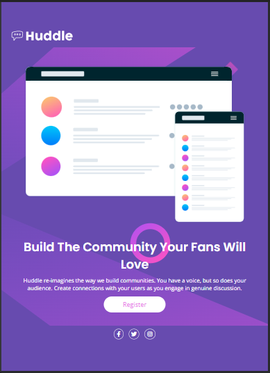
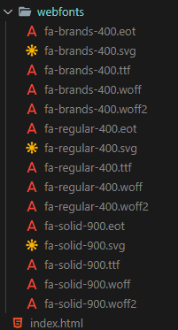
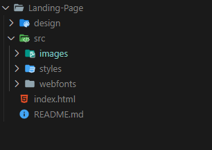

# Frontend Mentor - Huddle landing page com solução de uma seção introdutória simples

Essa é uma solução para o desafio [Huddle landing page com uma única seção introdutória no Frontend Mentor](https://www.frontendmentor.io/challenges/huddle-landing-page-with-a-single-introductory-section-B_2Wvxgi0).

## Tabela de conteúdos

- [Visão geral](#visão-geral)
  - [O desafio](#o-desafio)
  - [Screenshot](#screenshot)
- [Meu processo](#meu-processo)
  - [Construído com](#construído-com)
  - [O que eu aprendi](#o-que-eu-aprendi)
  - [Fontes úteis](#fontes-úteis)
- [Autor](#autor)
- [Agradecimentos](#agradecimentos)

## Visão geral

### O desafio

Usuários devem ser capazes de:

- Ver o layout otimizado para a página de acordo com as dimensões de seu dispositivo
- Ver os estados de foco para todos os elementos interativos na página

### Screenshot

- Versão Desktop 1440x757

  

- Versão Tablet 768x1060

  

- Versão Smartphone 375x1060

  

## Meu processo

### Construído com

- HTML5 markup Semântico
- CSS propriedades customizadas
- Flexbox
- CSS Grid
- Mobile-first workflow - Responsividade

### O que eu aprendi

Nesse projeto pude desenvolver habilidades como:

- o uso de tags semânticas do HTML5 na construção da estrutura base de uma página web;

```html
<!-- Uso de tags semânticas tais como -->
<header>Cabeçalho</header>
<main>Conteúdo principal</main>
<footer>Roda pé</footer>
```

- a estilização da mesma página com os recursos disponíveis no CSS, tais como Grid e Flexbox;

```css
/* Uso de display Flexbox */
body {
  display: flex;
  justify-content: center;
  align-items: center;
}
/* Uso de display Grid */
.container {
  color: #fff;
  min-height: 100vh;
  display: grid;
  grid-template-areas:
    "header header"
    "main main"
    "main main"
    "footer footer";
  grid-template-columns: repeat(2, 1fr);
  background: var(--violet) url(../images/bg-desktop.svg) center center no-repeat;
  padding: 5rem 0 5rem 8rem;
}
```

- a utilização de vários arquivos para melhor organização e delegação de funções, estas, por sua vez, ligadas a estrutura HTML principal com o uso de links;

```html
<link rel="stylesheet" href="src/styles/reset.css" />
<link rel="stylesheet" href="src/styles/variables.css" />
<link rel="stylesheet" href="src/styles/style.css" />
<link rel="stylesheet" href="src/styles/responsive.css" />
```

- o uso de variáveis em CSS;

```css
:root {
  --violet: hsl(257, 40%, 49%);
  --soft-magenta: hsl(300, 69%, 71%);
  --heading: "Poppins", sans-serif;
  --body: "Open Sans", sans-serif;
}
```

- o uso de versões mais simplificadas (shorthand) das propriedades para ter um código mais suscinto;

```css
.container {
  background: var(--violet) url(../images/bg-desktop.svg) center center no-repeat;
}
```

- a utilização de fontes externas para estilizar a paleta de fontes;

```html
<link rel="preconnect" href="https://fonts.googleapis.com" />
<link rel="preconnect" href="https://fonts.gstatic.com" crossorigin />
<link
  href="https://fonts.googleapis.com/css2?family=Open+Sans&family=Poppins:wght@400;600&display=swap"
  rel="stylesheet"
/>
```

```css
:root {
  --heading: "Poppins", sans-serif;
  --body: "Open Sans", sans-serif;
}
```

- o uso de ícone que represente o site na aba do navegador;

```html
<link
  rel="shortcut icon"
  href="./src/images/favicon-32x32.png"
  type="image/x-icon"
/>
```

- a criação de um arquivo que torne a estilização adaptativa (responsividade) tanto em navegadores via desktop, tablet ou smartphones;

```css
@media (max-width: 1024px) {
  .container {
    display: flex;
    flex-direction: column;
    justify-content: center;
    align-items: center;
    padding: 2rem;
    background: url(../images/bg-mobile.svg) top center no-repeat var(--violet);
    width: 100%;
  }
}
```

- o uso de web fontes para representar as redes sociais e economizar em uso de imagens.

```html
<link rel="stylesheet" href="src/styles/font-awesome.css" />
<a href="#">
  <i class="fab fa-facebook-f"></i>
</a>
<a href="#">
  <i class="fab fa-twitter"></i>
</a>
<a href="#">
  <i class="fab fa-instagram"></i>
</a>
```



- a orgazinação de pastas em estruturas



### Fontes úteis

- [Aplicação de shorthand](https://www.w3schools.com/css/css_font_shorthand.asp) - Esse conhecimento me ajudou a fazer um código mais suscinto (enxuto). Eu realmente gostei desse recurso e pretendo utilizá-lo continuamente.
- [Conceito de shorthand](https://developer.mozilla.org/pt-BR/docs/Web/CSS/Shorthand_properties) - Esse é um artigo muito útil e incrível que me ajudou a entender um pouco mais sobre shorthand. Recomendo a qualquer pessoa que necessite entender um pouco mais a respeito.

## Autor

- LinkdIn - [Michel Moreira](https://www.linkedin.com/in/michel-moreira-760142254/)
- Frontend Mentor - [@michel-moreira](https://www.frontendmentor.io/profile/michel-moreira)
- GitHub - [Michel Moreira](https://github.com/michel-moreira)

## Agradecimentos

À equipe Dev Em Dobro que com seu suporte, mentoria e aulas tornaram possível a aquisição do conhecimento que foram aplicados nesse projeto, o meu muito obrigado!
